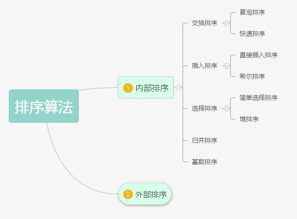
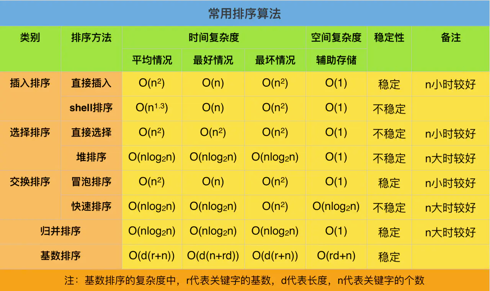
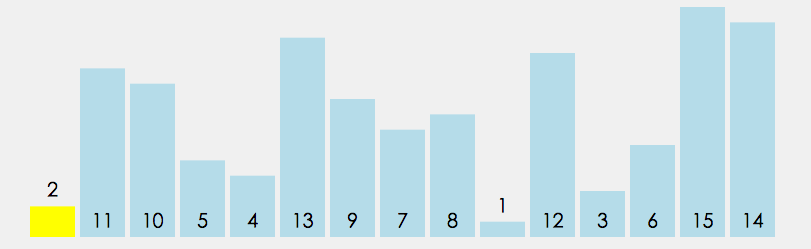
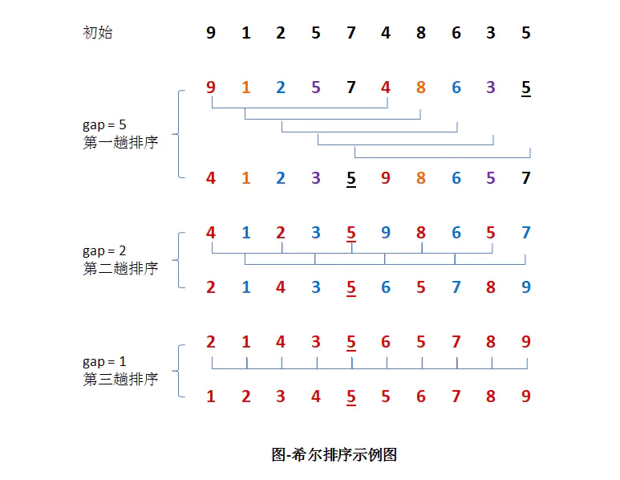

## 排序算法

### 常用种排序算法

冒泡排序、快速排序、直接插入排序、希尔排序、简单选择排序、堆排序、归并排序和基数排序，如果按原理划分，冒泡排序和快速排序都属于交换排序，直接插入排序和希尔排序属于插入排序，而简单选择排序和堆排序属于选择排序，如上图所示。

#### 时间复杂度及稳定性

### 冒泡排序

冒泡排序（Bubble Sort）是一种简单的排序算法。它重复访问要排序的数列，一次比较两个元素，如果他们的顺序错误就把他们交换过来。访问数列的工作是重复地进行直到没有再需要交换的数据，也就是说该数列已经排序完成。这个算法的名字由来是因为越小的元素会经由交换慢慢“浮”到数列的顶端，像水中的气泡从水底浮到水面。

冒泡排序是稳定的排序算法，最容易实现的排序, 最坏的情况是每次都需要交换, 共需遍历并交换将近n²/2次, 时间复杂度为O(n²). 最佳的情况是内循环遍历一次后发现排序是对的, 因此退出循环, 时间复杂度为O(n). 平均来讲, 时间复杂度为O(n²). 由于冒泡排序中只有缓存的temp变量需要内存空间, 因此空间复杂度为常量O(1)。

| 平均时间复杂度 | 最好情况 | 最坏情况 | 空间复杂度 |
| -------------- | -------- | -------- | ---------- |
| O(n2)          | O(n)     | O(n2)    | O(1)       |

### 快速排序

快速排序（Quicksort）是对冒泡排序的一种改进，借用了分治的思想，由C. A. R. Hoare在1962年提出。它的基本思想是：通过一趟排序将要排序的数据分割成独立的两部分，其中一部分的所有数据都比另外一部分的所有数据都要小，然后再按此方法对这两部分数据分别进行快速排序，整个排序过程可以递归进行，以此达到整个数据变成有序序列。

快速排序并不稳定，快速排序每次交换的元素都有可能不是相邻的, 因此它有可能打破原来值为相同的元素之间的顺序。

| 平均时间复杂度 | 最好情况 | 最坏情况 | 空间复杂度 |
| -------------- | -------- | -------- | ---------- |
| O(nlogn)       | O(nlogn) | O(n2)    | O(1)       |

### 直接插入排序

直接插入排序的基本思想是：将数组中的所有元素依次跟前面已经排好的元素相比较，如果选择的元素比已排序的元素小，则交换，直到全部元素都比较过为止。

直接插入排序不是稳定的排序算法。

| 平均时间复杂度 | 最好情况 | 最坏情况 | 空间复杂度 |
| -------------- | -------- | -------- | ---------- |
| O(n2)          | O(n)     | O(n2)    | O(1)       |

### 希尔排序

希尔排序，也称递减增量排序算法，1959年Shell发明。是插入排序的一种高速而稳定的改进版本。

希尔排序是先将整个待排序的记录序列分割成为若干子序列分别进行直接插入排序，待整个序列中的记录“基本有序”时，再对全体记录进行依次直接插入排序。

不稳定排序算法，希尔排序第一个突破O(n2)的排序算法；是简单插入排序的改进版；它与插入排序的不同之处在于，它会优先比较距离较远的元素，直接插入排序是稳定的；而希尔排序是不稳定的，希尔排序的时间复杂度和步长的选择有关，常用的是Shell增量排序，也就是N/2的序列，Shell增量序列不是最好的增量序列，其他还有Hibbard增量序列、Sedgewick 增量序列等

### 选择排序

在未排序序列中找到最小（大）元素，存放到未排序序列的起始位置。

不稳定排序算法，选择排序的简单和直观名副其实，这也造就了它出了名的慢性子，无论是哪种情况，哪怕原数组已排序完成，它也将花费将近n²/2次遍历来确认一遍。 唯一值得高兴的是，它并不耗费额外的内存空间。

| 平均时间复杂度 | 最好情况 | 最坏情况 | 空间复杂度 |
| -------------- | -------- | -------- | ---------- |
| O(n2)          | O(n2)    | O(n2)    | O(1)       |

### 归并排序

归并排序是建立在归并操作上的一种有效的排序算法，1945年由约翰·冯·诺伊曼首次提出。该算法是采用分治法（Divide and Conquer）的一个非常典型的应用，且各层分治递归可以同时进行。

| 平均时间复杂度 | 最好情况 | 最坏情况 | 空间复杂度 |
| -------------- | -------- | -------- | ---------- |
| O(nlogn)       | O(nlogn) | O(nlogn) | O(n)       |

稳定排序算法，从效率上看，归并排序可算是排序算法中的”佼佼者”. 假设数组长度为n，那么拆分数组共需logn, 又每步都是一个普通的合并子数组的过程，时间复杂度为O(n)， 故其综合时间复杂度为O(nlogn)。另一方面， 归并排序多次递归过程中拆分的子数组需要保存在内存空间， 其空间复杂度为O(n)。 和选择排序一样，归并排序的性能不受输入数据的影响，但表现比选择排序好的多，因为始终都是O(nlogn）的时间复杂度。代价是需要额外的内存空间。

### 基数排序

将所有待比较数值（正整数）统一为同样的数位长度，数位较短的数前面补零。然后，从最低位开始，依次进行一次排序。这样从最低位排序一直到最高位排序完成以后，数列就变成一个有序序列。

基数排序按照优先从高位或低位来排序有两种实现方案：

***MSD（Most significant digital）***  从最左侧高位开始进行排序。先按k1排序分组, 同一组中记录, 关键码k1相等, 再对各组按k2排序分成子组, 之后, 对后面的关键码继续这样的排序分组, 直到按最次位关键码kd对各子组排序后. 再将各组连接起来, 便得到一个有序序列。MSD方式适用于位数多的序列。

***LSD（Least significant digital）*** 从最右侧低位开始进行排序。先从kd开始排序，再对kd-1进行排序，依次重复，直到对k1排序后便得到一个有序序列。LSD方式适用于位数少的序列。

下图为LSD基数排序

基数排序不改变相同元素之间的相对顺序，因此它是稳定的排序算法，以下是基数排序算法复杂度：

| 平均时间复杂度 | 最好情况   | 最坏情况   | 空间复杂度 |
| -------------- | ---------- | ---------- | ---------- |
| O(d*(n+r))     | O(d*(n+r)) | O(d*(n+r)) | O(n+r)     |

其中，d 为位数，r 为基数，n 为原数组个数。在基数排序中，因为没有比较操作，所以在复杂上，最好的情况与最坏的情况在时间上是一致的，均为 O(d*(n + r))。

**基数排序 vs 计数排序 vs 桶排序**

这三种排序算法都利用了桶的概念，但对桶的使用方法上有明显差异：

基数排序：根据键值的每位数字来分配桶
计数排序：每个桶只存储单一键值
桶排序：每个桶存储一定范围的数值

